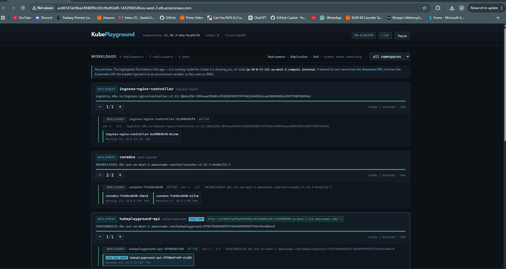
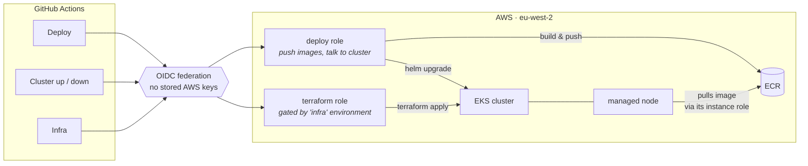
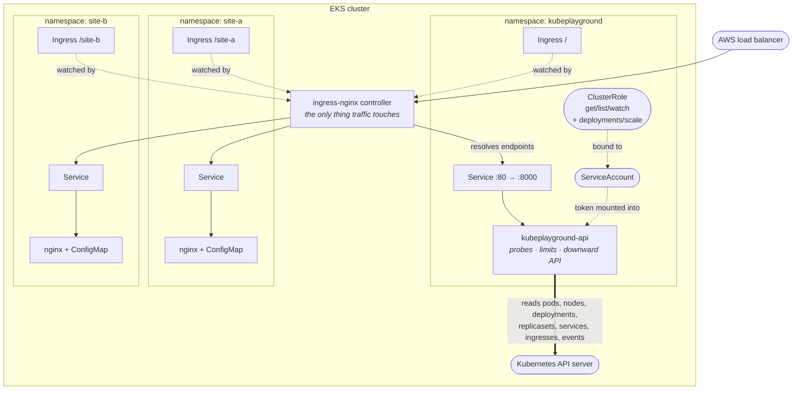

# KubePlayground

A web app that visualises a live Kubernetes cluster — **deployed into the cluster it observes**.

That constraint is the design. It can't list a Pod without a ServiceAccount and RBAC, can't be
reached without a Service and an Ingress, can't survive a node without probes and limits. Every
feature drags a Kubernetes object in with it.



- **Every action prints the `kubectl` it's equivalent to**
- **Every object renders as live YAML** 
- **The app marks its own Pod** 

I'm a Cloud/DevOps engineer — CI/CD, Terraform and Azure day to day — who had read about
Kubernetes but done none of it. I pursued this project to learn it. The mistakes are in
[`ROADMAP.md`](ROADMAP.md).

---

## Delivery



- The deploy role pushes images and talks to the cluster. 
- The terraform role can deploy terraform and create IAM roles — which means it can grant itself anything — so it's separated and gated behind a
GitHub environment that can require manual approval.

No AWS credentials are stored anywhere.

## Inside the cluster



**Two things run in here.**

1. **The app** — `kubeplayground`, which reads the cluster and can scale Deployments. What it is
   allowed to do is set by its ClusterRole. That is *authorisation*, and it constrains the **app**,
   not whoever is looking at it: anyone who can reach the URL gets the app's full permissions,
   which is why those permissions are kept deliberately narrow.

2. **Two demo sites** — plain nginx serving a page from a ConfigMap, each in its own namespace,
   there to prove the routing. The ingress controller watches all three Ingress objects and serves
   them from a single load balancer.

### App requirements

| the app needs to… | …so the cluster needs |
|---|---|
| read Pods across all namespaces | ServiceAccount, ClusterRole, ClusterRoleBinding |
| scale a Deployment from a button | `patch` on the `deployments/scale` **subresource** |
| show which workloads are reachable | `get list watch` on `networking.k8s.io/ingresses` |
| be reached from a browser | Service, Ingress, an ingress controller, EndpointSlice |
| survive a node | liveness / readiness / startup probes, requests and limits |
| mark its own Pod | the downward API — no RBAC at all, the kubelet injects it |
| show Pod detail and logs | `pods/log` and `events`, each a separate RBAC target |

## Decisions worth reading

**Least privilege at subresource granularity.** The scale button works; the app still cannot
redeploy anything.

```yaml
- apiGroups: ["apps"]
  resources: ["deployments"]
  verbs: ["get", "list", "watch"]   # read only
- apiGroups: ["apps"]
  resources: ["deployments/scale"]  # a SEPARATE RBAC target
  verbs: ["patch"]
```

`PATCH /deployments/{name}` and `.../scale` are different endpoints, so RBAC treats them as
different resources. The first lets you rewrite `spec.template` — a new image, a `hostPath` mount,
`privileged: true` — which is arbitrary code execution on every node. The second changes one
integer. If someone found a request-forgery bug here, the worst they could do is set a replica
count. Verified by deleting the verb and watching the 403.

---

## Running it

**Locally** — needs a cluster and an ingress controller:

```powershell
kubectl apply -f https://raw.githubusercontent.com/kubernetes/ingress-nginx/controller-v1.15.1/deploy/static/provider/cloud/deploy.yaml
docker build -f backend/Dockerfile -t kubeplayground-api:0.9.0 .
kubectl apply -f k8s/                                    # namespaces
helm install kubeplayground ./chart -n kubeplayground -f chart/values-local.yaml
helm install sites ./chart/sites -f chart/sites/values-local.yaml
```

Then <http://localhost/>, plus `site-a.localhost` and `site-b.localhost`.

**On AWS** — four workflows, and the environment is built to be destroyed between demos because
EKS bills from the moment it exists:

| workflow | trigger | does |
|---|---|---|
| `infra` | push to `terraform/` | the free tier — OIDC, IAM, ECR, VPC, state bucket |
| `cluster-up` | manual | creates EKS, installs the ingress controller, then calls Deploy |
| `deploy` | manual / push | builds, pushes to ECR, rolls out both charts. The only deploy path. |
| `cluster-down` | manual | uninstalls releases, removes the cluster, verifies nothing still bills |

`cluster-down` uninstalls **before** destroying: the load balancer belongs to the Helm release, not
Terraform, so removing the cluster first would strand it — still billing, invisible to state.

## Layout

```
backend/    FastAPI app + Dockerfile
frontend/   single-page UI, no build step
chart/      Helm chart for the app · chart/sites for the demo sites
k8s/        namespaces (everything else moved into charts)
terraform/  OIDC, ECR, VPC, EKS, access entries
```

Progress, findings and what's next: [`ROADMAP.md`](ROADMAP.md).
